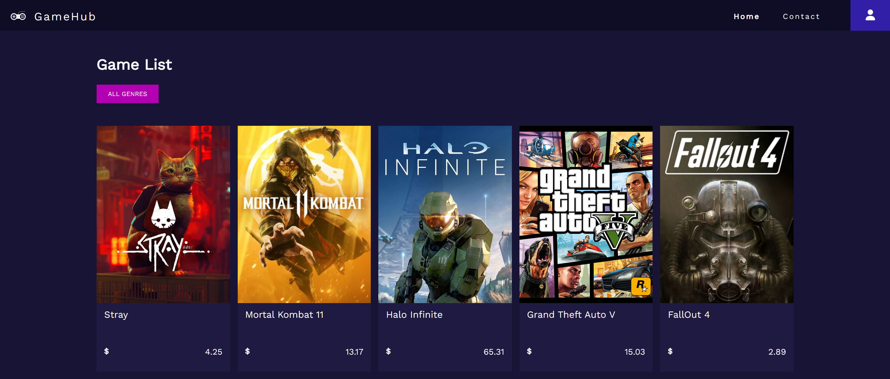

# 🎮 JS Frameworks CA - GameHub 


## 📜 Description
I used one of my WordPress API which I have had since 1st year at Noroff Vocational School while working on this assignment and practiced Reactjs throughout this entire course. In short, this API belongs to my cross-course project which I have used and still am using when I'm practicing the core coding languages HTML, CSS, SASS/SCSS and JavaScript in addition to ReactJS and NEXTjs. 
<br>
<br>
Live site to this project does currently not exsist, but we can run it locally on our computers by following the installation guidelines below 👇
### This project contains 🔍
- [x] An array of games from homepage. 
- [x] A single game is retrieved by a parameter (id). Each result are linked to a detail page, passing a parameter in URL. 
- [x] One of the forms are making a login request to a Wordpress API with JWT plugin installed.
  - If the login is unsuccessful, an error message will be displayed above the login form. 
  - And if the login is successful, we will be redirected to an admin page (route).
- [x] Simple contact form where inputted contact info will be sent directly to my professional (private) email, which was added with [EmailJS](https://blog.openreplay.com/sending-emails-from-react-with-emailjs/).
- [ ] New functionalities and overall improvements for this website are considered to be done during 2023 sometime after Portfolio 2's marked.
#### Login info 🔐
Please use your own WP local installation to be able to use admin functionality to this site. I used [this guide](https://themeisle.com/blog/install-xampp-and-wordpress-locally/) first before I configured my JWT auth in Wordpress REST API by following [this video tutorial](https://vimeo.com/520281229/d3f527f43e) to be set as authorised, and in this case be able to, for instance, using login form. 
## 🔧 Build With
I used [JWT Authentication for WP REST API](https://wordpress.org/plugins/jwt-authentication-for-wp-rest-api/) among these following tech packages and WordPress plugin(s) to build this React Web Application:
- [FontAwesome](https://fontawesome.com/v5/docs/web/use-with/react)
- [NPM](https://www.npmjs.com/)
- [React.js](https://reactjs.org/)
- [SASS](https://sass-lang.com/)
- [WooCommerce](https://wordpress.org/plugins/woocommerce/) (API json only) 
## 👩‍💻 Backend
In case you're having trouble making JWT Authentication for WP REST API working for you after following the guidelines from above, try to replace the following code in your ``.htacess`` file (which worked for me when I tried): 
```bash
<IfModule mod_rewrite.c>
RewriteEngine On
RewriteRule .* - [E=HTTP_AUTHORIZATION:%{HTTP:Authorization}]
RewriteBase /your-project-name-here/
RewriteRule ^index\.php$ - [L]
RewriteCond %{REQUEST_FILENAME} !-f
RewriteCond %{REQUEST_FILENAME} !-d
RewriteRule . /your-project-name-here/index.php [L]
</IfModule>
```
Replace ``your-project-name-here`` with the actual name of your installed WP folder, which you've named yourself before your WP installation. 
## 🚀 Getting Started
### Node version 🖥️
It is recommended to use node version <= 15 before we start with this project installment in case this should be necessary to be able to run the project successfully. 
1. Clone the repo from here:
```bash
https://github.com/lunadragon06/gamehub.git
```
2. Open the directory like this:
```bash
cd gamehub
```
3. Install following dependencies:
```bash
npm install
```
### Running 🌠
To run the app after installation of it is done, run this command in your terminal:
```bash
npm run start
```
..and you should be good to go!
## 🔗 Contributing
To contribute to this project, please create a new branch that can be reviewed and merged.
## 🏅 License
The project's original source and unchanged version of it can be obtained from the ``master`` branch in this repo. Or it can also be found taken from my other GitHub account [here](https://github.com/Noroff-FEU-Assignments/js-frameworks-course-assignment-LunaDragon666). <b>Note:</b> The link to the original repo may be set on private by [Noroff](https://github.com/Noroff-FEU-Assignments/) and only Noroff staff, apart from myself, will be able to get access to this particular shared link.  
## 🤙 Contact me
[LinkedIn](https://www.linkedin.com/in/monika-lie/)
<br>
[Student email](mailto:monlie16236@stud.noroff.no) 
## 🗨️ Acknowledgments
I would like to make this opportunity to thank [Tiffany](https://www.github.com/utvaer) for helping me out at the time I was working on this project with JWT AUTH for WordPress REST API and [Priscila](https://www.github.com/pkderlam87) to show me how to use and make React Hook Form & YUP validations when I was building login form.
<br>
<br>
I have these wonderful girls to thank for the fact that I have managed to pass and finish this JavaScript Framework Course Assignment, in addition to improve a great deal my learning curve experience 💗
<br><br>
